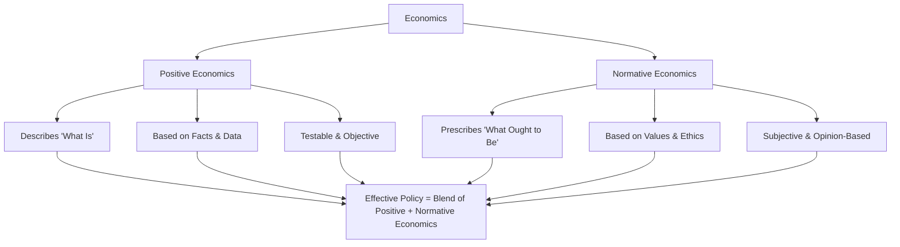

# 📊 Positive vs. Normative Economics: An Overview  

---

## 🌍 Introduction  
Economics lies **between scientific objectivity and subjective interpretation**.  

- Example:  
  - **Positive (factual):** *“This tax will likely increase government revenue by 10% per year.”*  
  - **Normative (value-based):** *“The government should use taxes to reduce inequality.”*  

> ✅ **Positive economics = What is** (testable, factual).  
> 🔔 **Normative economics = What ought to be** (value-based, opinion).  

This distinction was first highlighted in the **late 19th century by John Neville Keynes** (father of John Maynard Keynes):  
- **Positive economics →** “The science of what is.”  
- **Normative economics →** “The science of what ought to be.”

---

## 🧪 Positive Economics  
Positive economics deals with **objective, testable statements** about the economy.  

- Focuses on **facts, cause-and-effect, and data**.  
- Aims to explain and predict outcomes.  
- Uses **empirical evidence** and the **scientific method**.  

**Examples:**  
- 📈 “Government-provided healthcare increases public expenditures.”  
- ⛽ “Raising the gasoline tax will reduce consumption.”  
- 💵 “Increasing the minimum wage may affect unemployment levels.”  

> 💡 **Tip:**  
> Positive economics was strongly emphasized by **Milton Friedman**, Nobel Prize winner, who argued that economics should remain **an objective science**.  

---

## ⚖️ Normative Economics  
Normative economics involves **subjective judgments about desirable outcomes**.  

- Concerned with **values, ethics, and goals**.  
- Uses words like *“should,” “ought,” “better,”* or *“worse.”*  
- Cannot be tested or proven with data alone.  

**Examples:**  
- 🏥 “The government should provide basic healthcare to all citizens.”  
- 🌱 “Economic growth should not come at the cost of the environment.”  
- ⚖️ “Income inequality should be reduced.”  

> 💡 **Tip:**  
> A leading figure in normative economics is **Amartya Sen**, Nobel Prize winner, known for his work on welfare and development economics.  

---

## 🔍 Positive vs. Normative Economics (Comparison)  

| Aspect | 🧪 Positive Economics | ⚖️ Normative Economics |
|--------|-----------------------|-------------------------|
| **Nature** | Descriptive: *What is* | Prescriptive: *What ought to be* |
| **Basis** | Facts, data, cause-and-effect | Opinions, values, ethics |
| **Method** | Scientific, testable | Value-based, subjective |
| **Example** | “Raising taxes reduces disposable income.” | “Taxes should be raised to fund healthcare.” |
| **Role** | Explains and predicts | Recommends and evaluates |

---

## 🔗 From Description to Prescription  
- **Positive economics →** Provides a **factual foundation**.  
- **Normative economics →** Builds on this to set **policy goals and priorities**.  

➡️ They are **complementary**, not contradictory.  

**Key insight:**  
- Positive analysis without normative reasoning = **incomplete** (doesn’t tell us what to prioritize).  
- Normative reasoning without positive analysis = **dangerous** (can lead to well-intentioned but harmful policies).  

---

## ⚠️ Important Note  
Economists sometimes:  
- Present **normative statements as facts** (often unintentionally).  
- Blend **positive analysis with normative evaluation** to guide policy decisions.  

---

## 📌 The Bottom Line  
- 🧪 **Positive economics** = Explains how the economy works (factual, testable).  
- ⚖️ **Normative economics** = Suggests what economic outcomes should be (value-driven).  
- 🎯 **Good policymaking requires both**:  
  - **Positive analysis** to understand likely outcomes.  
  - **Normative reasoning** to decide which outcomes are most desirable.  

---
## 🖼️ Mermaid Diagram  

