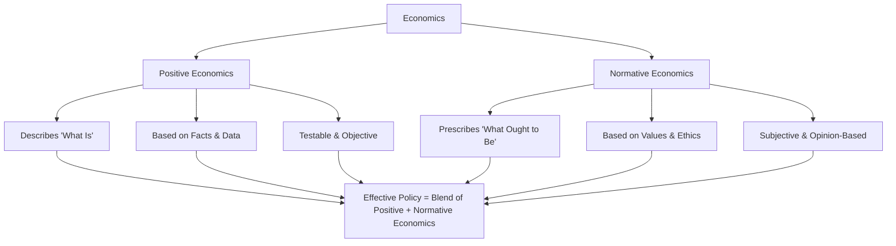

# 📘 Fundamentals of Microeconomics  
*A Structured Syllabus for Beginners & Intermediate Learners*  

---

## 📖 Course Description  
This course introduces the **principles of microeconomics**, focusing on how individuals, households, and firms make decisions under scarcity. You’ll learn to analyze **consumer behavior, production & cost structures, market dynamics, and government intervention**. By the end, you’ll be able to apply microeconomic tools to real-world issues.  

---

## 🎯 _Course Objectives_  
By completing this course, students will be able to:  
- 🔹 Understand **scarcity, opportunity cost, and trade-offs**  
- 🔹 Analyze **supply, demand, and market equilibrium**  
- 🔹 Examine **consumer & producer behavior** using utility and cost analysis  
- 🔹 Evaluate **market structures** (perfect competition, monopoly, oligopoly, etc.)  
- 🔹 Assess the role of **government in regulating markets & addressing failures**  
- 🔹 Apply **microeconomic reasoning** to policies and business decisions  

---

## 🗓️ Course Structure  
- **Duration:** 12–14 weeks (1 semester)  
- **Format:** 3 hours per week (Lecture + Tutorial/Discussion)  
- **Assessment:** Quizzes, Problem Sets, Midterm Exam, Final Exam, Project  

---

## 📅 Weekly Breakdown  

### **Unit 1: Introduction to Microeconomics (Weeks 1–2)**  
- What is economics? Scarcity & choice  
- Positive vs. normative economics  
- Opportunity cost & Production Possibilities Frontier (PPF)  
- Principles of decision making  
- Role of microeconomics in real-world problems  

### **Unit 2: Supply, Demand, and Market Equilibrium (Weeks 3–4)**  
- Law of demand & determinants  
- Law of supply & determinants  
- Market equilibrium: price determination  
- Shifts vs. movements along curves  
- Elasticity (price, income, cross-price)  
- Applications: price ceilings, floors, taxes, subsidies  

### **Unit 3: Consumer Behavior & Utility (Weeks 5–6)**  
- Total & marginal utility  
- Law of diminishing marginal utility  
- Budget constraints  
- Consumer equilibrium (cardinal & ordinal approaches)  
- Indifference curves & marginal rate of substitution  
- Derivation of demand curve  

### **Unit 4: Production and Costs (Weeks 7–8)**  
- Production function (short run vs. long run)  
- Law of variable proportions  
- Returns to scale  
- Costs of production (fixed, variable, total, marginal, average)  
- Long-run costs & economies of scale  

### **Unit 5: Market Structures (Weeks 9–11)**  
- **Perfect Competition**: features, equilibrium, efficiency  
- **Monopoly**: sources, pricing, inefficiency, regulation  
- **Monopolistic Competition**: differentiation, short-run vs. long-run  
- **Oligopoly**: kinked demand, collusion, game theory basics  

### **Unit 6: Market Failures & Government Role (Weeks 12–13)**  
- Externalities (positive & negative)  
- Public vs. private goods  
- Common resource problems (tragedy of the commons)  
- Government intervention: taxes, subsidies, regulation  
- Welfare economics: consumer & producer surplus  

### **Unit 7: Applications & Review (Week 14)**  
- Business & policy applications of microeconomics  
- Comprehensive review of concepts  
- Final exam prep  

## 📚 Recommended Textbooks  
- Mankiw, N. Gregory. *Principles of Microeconomics*  
- Varian, Hal. *Intermediate Microeconomics: A Modern Approach*  
- Besanko, D. & Braeutigam, R. *Microeconomics*  
## 🖼️ Mermaid Diagram  

✨ *Learn economics not just as a subject, but as a toolkit to understand the world.*  
